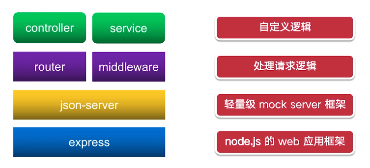

# Vue3+Pinia+Vite+TS 还原高性能外卖APP项目

## 相关文档

[Vite官网](https://cn.Vitejs.dev/guide/)

[husky的github地址](https://github.com/typicode/husky)

[commitlint的github地址](https://github.com/conventional-changelog/commitlint)

[https://zh-hans.eslint.org/](Eslint官网)

[Prettier官网](https://www.prettier.cn/)

[vant3官网](https://vant-contrib.gitee.io/vant/v3/#/zh-CN)

[vue-router官网](https://router.vuejs.org/zh/)

[postcss官网](https://postcss.org/)

## 使用Vite创建vue3项目

```
# npm 6.x
npm create Vite@latest my-vue-app --template vue
```


### 为什么选Vite?

当我们的应用越来越大型的时候，就会出现一些性能问题：

- 启动本地开发服务器的时间会很久
- 热更新也会很慢

### Vite是怎么优化的？

总的来说，Vite从两个方面优化：

- 开发服务器启动
- 热更新

#### 开发服务器启动

> Vite从依赖打包和源码打包这两个方面提升性能

- 依赖：使用**Esbuild**进行依赖打包，**Esbuild**使用**Go**编写，会比**javascript-based**的打包工具**快10-100倍**
- 源码：使用浏览器原生**Es module**提供源码，让浏览器接管打包工具的部分工作

#### 热更新

> Vite在文件热更新上做了优化：

- 使用**ESM**不需要重新编译：一些打包工具的开发服务器在文件更改时，需要重新构建整个项目，来获取新的模块依赖关系
- 使用浏览器缓存加速，Vite利用http头来加速整个页面的重新加载

## 配置Eslint、Prettier规范项目

### Eslint有什么用？

- 在运行代码前就发现语法错误和潜在的bug
- 非常适合用于制定团队代码规范
- ESlint的规则分为三个等级
  - off：关闭
  - warn：警告
  - error： 错误

> 可以根据自己的需求来配置等级

### 配置.eslintrc

```
{
  "extends": [
    "plugin:@typescript-eslint/recommended",
    "eslint-config-airbnb-base",
    "@vue/typescript/recommended",
    "plugin:vue/vue3-recommended",
    "plugin:vue-scoped-css/base",
    "plugin:prettier/recommended"
  ],
  "env": {
    "browser": true,
    "node": true,
    "jest": true,
    "es6": true
  },
  "globals": {
    "defineProps": "readonly",
    "defineEmits": "readonly"
  },
  "plugins": ["vue", "@typescript-eslint"],
  "parserOptions": {
    "parser": "@typescript-eslint/parser",
    "sourceType": "module",
    "allowImportExportEverywhere": true,
    "ecmaFeatures": {
      "jsx": true
    }
  },
  "settings": {
    "import/extensions": [".js", ".jsx", ".ts", ".tsx"]
  },
  "rules": {
    "no-console": "off",
    "no-continue": "off",
    "no-restricted-syntax": "off",
    "no-plusplus": "off",
    "no-param-reassign": "off",
    "no-shadow": "off",
    "guard-for-in": "off",

    "import/extensions": "off",
    "import/no-unresolved": "off",
    "import/no-extraneous-dependencies": "off",
    "import/prefer-default-export": "off",
    "import/first": "off", // https://github.com/vuejs/vue-eslint-parser/issues/58
    "@typescript-eslint/no-explicit-any": "off",
    "@typescript-eslint/explicit-module-boundary-types": "off",
    "vue/first-attribute-linebreak": 0,

    "@typescript-eslint/no-unused-vars": [
      "error",
      {
        "argsIgnorePattern": "^_",
        "varsIgnorePattern": "^_"
      }
    ],
    "no-unused-vars": [
      "error",
      {
        "argsIgnorePattern": "^_",
        "varsIgnorePattern": "^_"
      }
    ],
    "no-use-before-define": "off",
    "@typescript-eslint/no-use-before-define": "off",
    "@typescript-eslint/ban-ts-comment": "off",
    "@typescript-eslint/ban-types": "off",
    "class-methods-use-this": "off" // 因为AxiosCancel必须实例化而能静态化所以加的规则，如果有办法解决可以取消
  },
  "overrides": [
    {
      "files": ["*.vue"],
      "rules": {
        "vue/component-name-in-template-casing": [2, "kebab-case"],
        "vue/require-default-prop": 0,
        "vue/multi-word-component-names": 0,
        "vue/no-reserved-props": 0,
        "vue/no-v-html": 0,
        "vue-scoped-css/enforce-style-type": ["error", { "allows": ["scoped"] }]
      }
    },
    {
      "files": ["*.ts", "*.tsx"], // https://github.com/typescript-eslint eslint-recommended
      "rules": {
        "constructor-super": "off", // ts(2335) & ts(2377)
        "getter-return": "off", // ts(2378)
        "no-const-assign": "off", // ts(2588)
        "no-dupe-args": "off", // ts(2300)
        "no-dupe-class-members": "off", // ts(2393) & ts(2300)
        "no-dupe-keys": "off", // ts(1117)
        "no-func-assign": "off", // ts(2539)
        "no-import-assign": "off", // ts(2539) & ts(2540)
        "no-new-symbol": "off", // ts(2588)
        "no-obj-calls": "off", // ts(2349)
        "no-redeclare": "off", // ts(2451)
        "no-setter-return": "off", // ts(2408)
        "no-this-before-super": "off", // ts(2376)
        "no-undef": "off", // ts(2304)
        "no-unreachable": "off", // ts(7027)
        "no-unsafe-negation": "off", // ts(2365) & ts(2360) & ts(2358)
        "no-var": "error", // ts transpiles let/const to var, so no need for vars any more
        "prefer-const": "error", // ts provides better types with const
        "prefer-rest-params": "error", // ts provides better types with rest args over arguments
        "prefer-spread": "error", // ts transpiles spread to apply, so no need for manual apply
        "valid-typeof": "off" // ts(2367)
      }
    }
  ]
}
```

### 什么是Prettier？

- 代码格式化工具，用于检测代码中的格式问题
- Eslint偏向于把控项目的代码质量，而Prettier更偏向于统一项目的编码风格

### 配置.prettierrc.js

```
module.exports = {
    extends: ['@commitlint/config-conventional'],
    // 校验规则
    rules: {
      'type-enum': [
        2,
        'always',
        [
          'feat',
          'fix',
          'docs',
          'style',
          'refactor',
          'perf',
          'test',
          'chore',
          'revert',
          'build',
        ],
      ],
      'type-case': [0],
      'type-empty': [0],
      'scope-empty': [0],
      'scope-case': [0],
      'subject-full-stop': [0, 'never'],
      'subject-case': [0, 'never'],
      'header-max-length': [0, 'always', 72],
    },
  }
```

### .vscode下新建settings.json

```
# settings.json
{
  "files.autoSave": "off",
  "eslint.validate": [
    "javascript",
    "javascriptreact",
    "vue-html",
    {
      "language": "vue",
      "autoFix": true
    }
  ],
  "eslint.run": "onSave",
  "eslint.autoFixOnSave": true,
  "editor.codeActionsOnSave": {
    "source.fixAll.eslint": true
  },
  "editor.formatOnSave": true, // 开启保存文件自动格式化代码
  "editor.defaultFormatter": "esbenp.prettier-vscode", // 默认的代码格式化工具
  "prettier.requireConfig": true,
  "[vue]": {
    "editor.defaultFormatter": "esbenp.prettier-vscode"
  } // 需要Prettier的配置文件
}
```

## 使用husky管理Git hooks

- husky
- Git hooks

### 什么是Git hooks？

- hooks: 一些时机的回调
- Git hooks：Git流程中时机的回调

### 如何使用Git hooks?

- 自己写脚本
- 对Git有一定了解

### 什么是husky？

- 校验commit信息
- 运行测试代码
- 校验代码格式......

### 安装husky

[相关文档](https://juejin.cn/post/7193519302853525560?searchId=20230829165842AC44965ADE8AA0B17254)

1. 安装

```
git init
npx husky-init '&&' npm install
# 另外新增一个hooks，commit-msg
npx husky add .husky/commit-msg
```

2. 在**commit-msg**文件中添加 `npm run commitlint`
3. 在pre-commit文件中有一个`npm run test`我们注释掉，不然会报错

## 使用commitlint规范commit信息

- commitlint规范
- 如何使用commitlint

### 什么是commitlint?

> 提交commit时需要填写commit信息，对这些commit的填写做一个规范

### 为什么需要commitlint?

- 产生大量的commit版本，这些commit记录了整个项目的开发进程
- 良好的commit信息有利于后期维护

### 怎么规范？

- 提供一套规范来约束项目的commit信息
- 在提交commit的时候自动校验
- 规范要求我们按一下规定来填写commit信息

```
type(scope?):subject
// type表示commit的类型
// scope是可选的，表示当前commit修改的模块范围
// subject就是描述commit的详细说明
```

### 常见的type类型

- feat：新功能
- fix：Bug 修复
- docs：文档更新
- style：代码样式更改，例如空格、格式、缺少分号等
- refactor：重构代码
- perf：性能优化
- test：添加缺失或修正测试代码
- chore：构建相关的代码或工具库，如文档生成等

### 安装commitlint

[相关文档](https://juejin.cn/post/7193519302853525560?searchId=20230829165842AC44965ADE8AA0B17254)

​	1.安装

```
# For Windows:
npm install --save-dev @commitlint/config-conventional @commitlint/cli

# Configure commitlint to use conventional config
echo "module.exports = {extends: ['@commitlint/config-conventional']}" > commitlint.config.js
```

2. 添加配置文件，新建`commitlint.config.js`，然后添加下面的代码

```js
module.exports = {
    extends: ['@commitlint/config-conventional'],
    // 校验规则
    rules: {
      'type-enum': [
        2,
        'always',
        [
          'feat',
          'fix',
          'docs',
          'style',
          'refactor',
          'perf',
          'test',
          'chore',
          'revert',
          'build',
        ],
      ],
      'type-case': [0],
      'type-empty': [0],
      'scope-empty': [0],
      'scope-case': [0],
      'subject-full-stop': [0, 'never'],
      'subject-case': [0, 'never'],
      'header-max-length': [0, 'always', 72],
    },
  }
```

3. 配置script

   > 因为我们需要运行`npm run commitlint`，所以需要在`package.json`文件中添加如下代码：

   ```ts
   # 在scrips中添加下面的代码
   {
   "scripts": {
       "commitlint": "commitlint --config commitlint.config.js -e -V"
     },
   }
   ```

## 安装vant-ui和使用Vite按需加载组件

[vant3官网](https://vant-contrib.gitee.io/vant/v3/#/zh-CN/quickstart)

### 什么是Tree Shaking?

- 移除无用的资源，包括JS代码、CSS文件


### unplugin-vue-components

> 在基于 `vite`、`webpack` 或 `vue-cli` 的项目中使用 Vant 时，可以使用 [unplugin-vue-components](https://github.com/antfu/unplugin-vue-components) 插件，它可以自动引入组件，并按需引入组件的样式。
>
> 相比于常规用法，这种方式可以按需引入组件的 CSS 样式，从而减少一部分代码体积，但使用起来会变得繁琐一些。如果业务对 CSS 的体积要求不是特别极致，我们推荐使用更简便的常规用法。

- 安装插件
- 在vite.config.js中配置插件
- 直接在模版使用Vant组件
- 引入函数组件的样式

## vue-router实现页面路由

### 什么是**vue-router**?

- 嵌套路由映射
- 动态路由选择
- 模块化、基于组件的路由配置
- 路由参数、查询、通配符
- **HTML5 history**模式或**hash**模式

### 什么是路由？

- **单页面应用SPA**
  - <u>不刷新而切换页面某部分</u>
- 单页面应用路由
  - 应用页面的状态
  - pathname(**history api**)或**hash**

### 如何配置路由？

- 内容组件渲染的地方

  > <router-view>

- 路由与组件的对应关系

  > router实例config

- 触发路由跳转的地方（如果需要的话）

  > <router-link>或代码动态设置

### 示例

```vue
<script setup lang="ts">
// import { Tabbar, TabbarItem } from 'vant';
import { RouterView, useRoute, useRouter } from 'vue-router';
import { ref, watch } from 'vue';

const route = useRoute(); // 获取当前路由状态
const router = useRouter(); // 获取路由实例

// 记录当前选择的tab
const active = ref(route.name as string);

watch(active, (nv) => {
  router.push({
    name: nv,
  });
});
</script>

<template>
  <RouterView />
  <van-tabbar v-model="active">
    <van-tabbar-item name="home" icon="home-o">首页</van-tabbar-item>
    <van-tabbar-item name="order" icon="bars">订单</van-tabbar-item>
    <van-tabbar-item name="me" icon="contact">我的</van-tabbar-item>
  </van-tabbar>
</template>
```

## 使用json-server搭建Mock Server

### 为什么学？

经常需要使用mock数据来模拟后端提供接口数据

### 什么是Mock Server?


### 什么是json-server?

- **Mock Server**搭建工具
  - 轻易搭建拥有完整**REST API**的轻量级后端服务
- 使用**json-server**方式
  - 通过**json-server**命令启动一个服务
  - 通过**module**将**json-server**引入到自己的node服务



### 架构

- middleware：中间件，用来处理所有请求，比如鉴权、静态资源等功能
  - json-server提供的中间件：静态资源、请求体解析
  - 自定义中间件：鉴权
- router：带路由url的中间件，处理特定路由url的请求
  - json-server的路由：一些直接使用json数据的api
  - 自定义路由：有自定义逻辑的api

### 文件结构

- data：存放所有数据json文件
- public：存放静态资源，比如图片
- src：项目的处理逻辑
  - app.js：项目入口文件，包括应用创建、中间件使用
  - router.js：处理自定义路由
  - db.js：处理json-server的路由
  - controller：存放controller
  - service：存放service

## 介绍Vite和使用Vite配置请求代理

### 什么是跨域？

- 同源
  - 协议protocol
  - 端口port
  - 域名host

### 为什么要限制跨域？

- 出于安全性，浏览器会限制脚本内发起跨源HTTP请求
  - XMLHttpRequest和Fetch API
- Web应用
  - 只能从加载应用程序的同一个请求HTTP资源
  - 除非包含CORS响应头

### 如何解决跨域？

- 常用的跨域方案
  - jsonp：<script>不受同源策略限制
  - 跨源域资源共享CORS：允许Web应用服务器进行跨源访问控制
  - 使用不同的源变成同源

### 什么是反向代理？

- 代理：请求转发


- 代理服务器类型
  - 正向代理：客户端告诉代理服务器资源的地址
  - 反向代理：客户端只告诉要什么资源

### 反向代理如何解决跨域问题？


### vite代理


## 使用axios请求库，设置请求拦截

### 什么是http状态码？

- HTTP响应状态码表明特定HTTP请求是否成功完成
  - 信息响应（100-199）
  - 成功响应（200-299）
  - 重定向消息（300-399）
  - 客户端错误响应（400-499）
  - 服务端错误响应（500-599）

### 什么是业务状态码？

- 扩展请求的状态


## 使用post-css实现移动端适配

### 为什么学？

- 移动端适配影响用户获取的信息量和体验

### 学习内容

- 介绍移动端适配以及适配方案
- 介绍post-css
- 使用post-css实现移动端适配

### 常用适配方案

- 不同端使用不同代码，比如PC端一套代码，移动端一套代码
- 不同端使用同一套代码，一般使用CSS样式来控制
- 移动端屏幕适配
  - 利用rem按根节点（body）的字体大小来缩放
  - 利用vh/vw按屏幕高度和宽度来缩放

### rem适配方案？

- rem是跟px类似的css数量单位
  - 当前属性大小值按根节点body的font-size等比例计算
- 将css属性单位从px改为rem
- 动态获取用户设备的屏幕宽度


> fontSize(body)是动态改变的

- px转rem


### 什么事post-css?

- css转换工具


- autoprefixer：自动管理css属性的浏览器前缀
- postcss-pxtorem：px转换为rem

### 安装postcss和相关插件

```node
npm i postcss autoprefixer postcss-pxtorem -D
```

### 新建postcss.config.js文件

```js
module.exports = {
  plugins: {
    autoprefixer: {
      overrideBrowserslist: ['Android >= 4.0', 'iOS >= 7'],
    },
    'postcss-pxtorem': {
      // 根节点的 fontSize 值
      rootValue: 16,
      propList: ['*'],
      selectorBlackList: [':root'],
    },
  },
}
```

### main.ts配置

```js
const rootValue = 16; // 设计稿中的body
const rootWidth = 390; // 设计稿中俄屏幕
const deviceWidth = document.documentElement.clientWidth; // 屏幕
document.documentElement.style.fontSize = (deviceWidth * rootValue) / rootWidth + 'px'; // body
```

## normalize.css处理不同浏览器的默认样式

### 安装

```
npm install normalize.css
```

### App.vue中配置

```vue
<style scoped>
@import 'normalize.css';

#app {
  /** 字体抗锯齿，让字体看起来更清晰 */
  -webkit-font-smoothing: antialiased;
  -moz-osx-font-smoothing: grayscale;
  color: #2c3e50;
}
</style>
```

## sass：css预处理器

### 安装

```
npm install sass -D
```

## BEM命名规范

- Bem是块（block）、元素（element）、修饰符（modifier）的简写
  - **-中划线**：仅作为连字符使用，表示某个块或者某个子元素的多单词之间的连接记号
  - **__双下划线**：双下划线用来连接块和块的子元素
  - **--双中划线**：双中划线用来描述一个块或者块的子元素的一种状态

## 自定义hook

- hooks介绍
- 如何实现一个hooks
- 事件传递实现跨组件通信